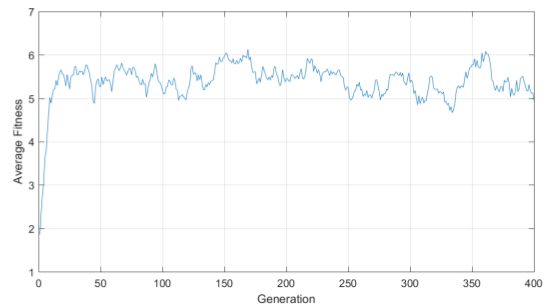

# AI CSE 482 course second homework

Implement genetic algorithm for Maximum Weighted Independent Set Problem

Detailed information can be found in docs directory.

Comparison of repair functions

An example improvement of population over generations 

A table of avarege fitness 

